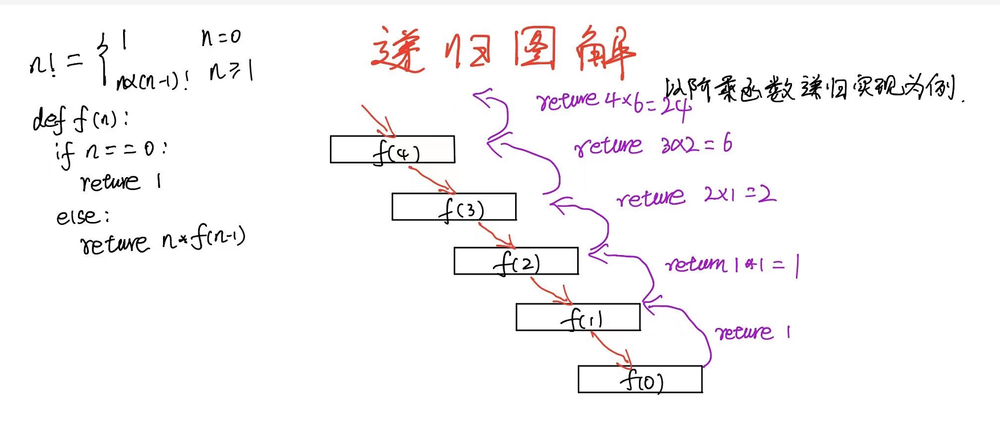

# 递归

[TOC]

## 1. 递归的定义

​		**递归：** 自己调用自己就叫做递归。

​		**直接递归：**递归函数或者方法中直接包括自身

​		**间接递归：**递归函数或者方法中调用的函数或方法又有调用该递归函数

## 2. 使用递归的三个条件

- **待解决的问题可以分解为多个子问题**
- **分解成的子问题解决方式跟父问题一样**
- **存在停止递归的条件**

## 3. 递归的俩个特点

1. 调用自身
2. 拥有结束条件

## 4. 以阶乘函数图解递归

